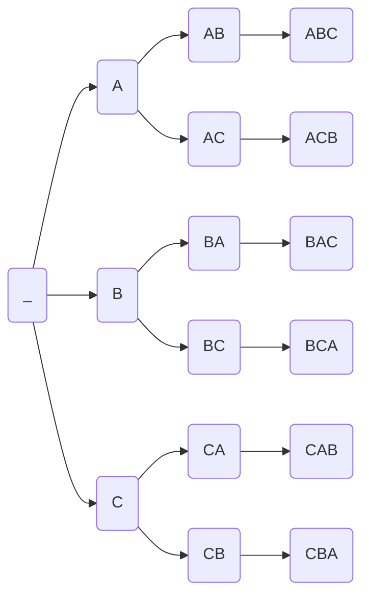

import EqPlot from '../components/EqPlot.jsx'
import SlopeLine from '../components/SlopeLine.jsx'
import NumberLineMulNegOneExample from '../components/NumberLine.jsx'
import ReImRotExample from '../components/ImaginaryRotation.jsx'
import LinearApproximationTaylor from '../components/LinearApproximationTaylor.jsx'

# Journey from Euler to 
## Complex Number
<NumberLineMulNegOneExample client:visible/>
 
This is the good and old number line. Here, we see:

> Number is **multiplied by $+1$**
$\Longrightarrow$
**Nothing** happens.

> Number is **multiplied by $-1$**
$\Longrightarrow$
Number gets **reflected** to the other side.
 
Let's see why.  First we start by acknowledging:

$$
\begin{aligned}
\text{Reflection} &\equiv \text{Rotation by} \pm180^{\circ} \text{(i.e.} \pm\pi \text{ rad)}\\
\text{i.e.} \boldsymbol{-1} &= \boldsymbol{1\angle180^\circ}
\end{aligned}
$$
 
<ReImRotExample client:visible/>
 
But for the **rotation** to be **possible**, we had to add a second **perpendicular axis**.

A natural curiosity would be to only rotate 90$^\circ$ to explore the new axis.

$$
\begin{aligned}
(-1)\times(-1)&=(+1) \\
1\angle180^\circ \times 1 \angle 180^\circ &= 1\angle 360^\circ \\
\\
\text{Similary,}\\
(\text{something})\times (\text{something}) &= (-1) \\
1\angle90^\circ \times 1 \angle 90^\circ &= 1\angle 180^\circ \\
\end{aligned}
$$
Let's find this "$\text{something}$": &nbsp; $x^2 = -1 \Longrightarrow x = \pm \sqrt{-1} = ?$

 
Just like how numbers 0, 1, 2 are different from each other, this is also a new kinda number we have just discovered (we'll call it a *complex number*). Since we don't have any space on the number line, we put it earlier on a new axis (called *imaginary axis*). Our number line was actually a small section of the 2D *complex plane* all along. We denote this number using $i$ (*imaginary*).
 

$$
\begin{aligned}
\boldsymbol{\therefore i^2} &= \boldsymbol{-1}\\
\boldsymbol{i} &= \boldsymbol{1 \angle \frac\pi2}
\end{aligned}
$$

 
---
 
$\boldsymbol{z = x + iy = r\angle \theta}$ can be defined as a **complex number** on the complex plane.

where

$x =$ real part $=$ &nbsp; Re(z) or $\Re (z)$

$y =$ imaginary part $=$ &nbsp; Im(z) or $\Im (z)$

$r =$ distance from origin (0, 0) $ = |z| = \sqrt{x^2 + y^2}$

$\theta = $ angle from X axis $=\arg(z)$
 
---
 
## Unit circle
Let $z = x+iy$ be any arbitrary point on the circle.

All points of a circle are at same distance (called *radius*) from the center of the circle.

 
**Equation of circle:** 

$$
\begin{aligned}
|z| &= \text{radius}\\
\sqrt{x^2+y^2}&=r\\
x^2+y^2&=r^2
\end{aligned}
$$
**Unit circle** is the path traced by the number 1 as it rotates around the origin in the complex plane.
 
Number 1 is at distance 1 from origin.

$\Longrightarrow$ All points are at distance 1 from origin.

$\Longrightarrow \text{radius } = 1$

$\therefore r = \text{const }$, $z$ depends mainly on $\theta$

Let $x = f_1(\theta), \text{ }y = f_2(\theta)$

 
**Measurements from the unit circle:**
| | $0$ | $\dfrac{\pi}{4}$ | $\dfrac{\pi}{2}$ | $\dfrac{3\pi}{4}$ |
| :--- | :---: | :---: | :---: | :---: |
| $x=f_1(\theta)$ | $1$ | $\dfrac{\sqrt{2}}{2}$ | $0$ | $-\dfrac{\sqrt{2}}{2}$ |
| $y=f_2(\theta)$ | $0$ | $\dfrac{\sqrt{2}}{2}$ | $1$ | $\dfrac{\sqrt{2}}{2}$ |

 

| | $\pi$ | $\dfrac{5\pi}{4}$ | $\dfrac{3\pi}{2}$ | $\dfrac{7\pi}{4}$ |
| :--- | :---: | :---: | :---: | :---: |
| $x=f_1(\theta)$ | $-1$ | $-\dfrac{\sqrt{2}}{2}$ | $0$ | $\dfrac{\sqrt{2}}{2}$ |
| $y=f_2(\theta)$ | $0$ | $-\dfrac{\sqrt{2}}{2}$ | $-1$ | $-\dfrac{\sqrt{2}}{2}$ |

 
These doesn't seem to be some familiar function. We can define these as new functions named *cosine* and *sine*.
$f_1(\theta)=\cos(\theta)$ and $f_2(\theta)=\sin(\theta)$
 

 
<EqPlot
  funcStrings={['Math.cos(x)']}
  containerStyle = {{
    maxHeight: '200px'
  }}
  boardConfig={{
    boundingbox: [-3*Math.PI-0.18, 1.5, 3*Math.PI+0.36, -1.5],
    axis: true,
    fixed: true,
    showCopyright: false,
    defaultAxes: {
        x: {
            name: 'θ',
            withLabel: true,
            label: {
                position: 'rt',
                offset: [5, 15],
                anchorX: 'right'
            },
            ticks: {
                minTicksDistance: 0,
                minorTicks:4,
                ticksDistance: 3,
                scale: Math.PI,
                scaleSymbol: 'π',
                insertTicks: true
            }
        },
        y: {
            name: 'cos(θ)',
            withLabel: true,
            ticks: {
              ticksDistance: 0.5
            },
            label: {
                position: 'rt',
                offset: [-50, 5],
                anchorY: 'top'
            }
        }
    }
  }}
  client:visible
/>
 
<EqPlot
  funcStrings={['Math.sin(x)']}
  containerStyle = {{
    maxHeight: '200px'
  }}
  boardConfig={{
    boundingbox: [-3*Math.PI-0.18, 1.5, 3*Math.PI+0.36, -1.5],
    axis: true,
    fixed: true,
    showCopyright: false,
    defaultAxes: {
        x: {
            name: 'θ',
            withLabel: true,
            label: {
                position: 'rt',
                offset: [5, 15],
                anchorX: 'right'
            },
            ticks: {
                minTicksDistance: 0,
                minorTicks:4,
                ticksDistance: 3,
                scale: Math.PI,
                scaleSymbol: 'π',
                insertTicks: true
            }
        },
        y: {
            name: 'sin(θ)',
            withLabel: true,
            ticks: {
              ticksDistance: 0.5
            },
            label: {
                position: 'rt',
                offset: [-50, 5],
                anchorY: 'top'
            }
        }
    }
  }}
  client:visible
/>
 
 
**Some Important Identities:**

$$
\begin{aligned}
\sin(\theta \pm 2\pi) = \sin(\theta)\\
\cos(\theta \pm 2\pi) = \cos(\theta)
\end{aligned}
$$
So, these are called **periodic functions**
(repeat at regular intervals, called *period*)

Here, period $=2\pi$.

$$
\begin{aligned}
\sin(-\theta) &= -\sin\theta\\
\cos(-\theta) &= \cos\theta\\\\
\sin\theta &= \cos(\theta - \frac\pi2)\\
\end{aligned}
$$
---
 

$$
\begin{aligned}
\therefore &\text{ For unit circle:}\\
|z|&=\sqrt{\cos^2\theta + \sin^2\theta}=1\\
z &= cos\theta + i \sin\theta
\end{aligned}
$$

 
Generalizing,

$$
\boldsymbol{z = r\angle\theta = r (\cos\theta + i\sin\theta)}
$$

---
 
## Taylor Series
We said that the cosine and sine functions did not resemble any functions we knew.

But we might want a method to **approximate** these functions numerically. Graphically drawing a circle each time and measuring might not be convenient.
 
If we **ignore** the **periodicity** of cosine for a while, we see,

$cos(x)$ resembles $1-x^2$ a liii...ttle bit, especially at the origin ($x=0$).
 
*We've started using $x$ instead of $\theta$ but it's just a different name for the same variable,*

*no connection with the $z=x+iy$*

 

How I came up with $1-x^2$

I knew that plot of $f(x)=x^2$ is a parabola (U shaped)

Then $f(x)=-x^2$ should be a ∩ shaped [ $\because\times(-1)$ flipped the direction]

Now, the shape roughly matches.
 
Problem: $cos(0) = 1$ but $f(0)=-0^2 = 0$

Add 1 so that
$f(x) = 1-x^2$

$f(0)=1-0^2 = 1 =cos(0)$

 

<EqPlot
  funcStrings={['1-x*x']}
  containerStyle = {{
    maxHeight: '200px'
  }}
  boardConfig={{
    boundingbox: [-Math.PI-0.18, 2.2, Math.PI+0.36, -5.5],
    axis: true,
    fixed: true,
    showCopyright: false,
    defaultAxes: {
        x: {
            name: 'x',
            withLabel: true,
            label: {
                position: 'rt',
                offset: [5, 15],
                anchorX: 'right'
            },
            ticks: {
                minTicksDistance: 0,
                minorTicks:4,
                ticksDistance: 3,
                scale: Math.PI,
                scaleSymbol: 'π',
                insertTicks: true
            }
        },
        y: {
            name: '1-x^2',
            withLabel: true,
            ticks: {
              ticksDistance: 0.5
            },
            label: {
                position: 'rt',
                offset: [-50, 5],
                anchorY: 'top'
            }
        }
    }
  }}
  client:visible
/>
 
---
 
But such method cant be used to accurately approximate. We need a more robust method.
Let us take a **leap of faith** and just say...

$cos(x) = a_0 + a_1x + a_2x^2 + \ldots$
 

We need to find a method that will calculate 
$a_0 = ?$, $a_1=?$, $a_2=?$, $\ldots$

We don't have a formula or anything for $cos(x)$ yet that we could use to simplify.
We can only **evaluate** it at **different points** using that unit circle.
 

Our method needs to take values of $cos(x)$ at different points and spit out $a_0, a_1, a_2, \ldots$

For $f(x)=x^3$, the method would output $a_3 = 1, a_0 = a_1 = a_2 = a_4 = \ldots = 0$

 
This is actually called **McLaurin series**.
It is a **generalization of Taylor series** (approximated at origin i.e. calculated at $\boldsymbol{a = 0}$).
 
**Taylor Series** approximation of a function f(x) **at point** $\boldsymbol{x = a}$ is:

$$
\boldsymbol{f(x) = a_0+a_1(x-a) + a_2(x-a)^2+\dots}
$$
 
---
 
## Derivative
If we evaluate the approximated function $f(x)$ at $x = a$

$$
\begin{aligned}
f(a) &= a_0 + a_1(a-a)+a_2(a-a^2)\\
\Longrightarrow a_0 &= f(a)
\end{aligned}
$$

The approximation still has an infinite no. of terms which we can't tackle yet.
So, let us simplify the approximation even more (*just to explore*):

$$
\begin{aligned}
f(x) &= f(a) + a_1 (x-a)\\
\\
\Longrightarrow a_1 &= \dfrac{f(x)-f(a)}{x-a}
\end{aligned}
$$
---
 
For a *circle*,

**distance** between **origin** and any **point** of circle $= \text{constant}$
 
For a *straight line*,

**steepness** $= \text{constant}$

i.e. Relationship between **vertical change (rise)** and **horizontal change (run)** $= \text{constant}$ (called **Slope**)

$$
\begin{aligned}
\text{Slope}&=\frac{\text{Rise}}{\text{Run}}&=\frac{\Delta f}{\Delta x}\\
\\
a_1 &= \dfrac{f(x)-f(a)}{x-a} &= \frac{\Delta f}{\Delta x}
\end{aligned}
$$
So, this is actually the **equation of a straight line**.
 
<SlopeLine client:visible/>
 
---
 
We had earlier ignored all the other terms like $a_2 (x-a)^2+a_3(x-a)^3+\ldots$.

If we do this, we can only approximate the function as a line (called **tangent line**).

The curviness is not approximated yet.
 
<LinearApproximationTaylor client:visible/>
 
Still, this approximation definitely holds near $x=a$ and **only near** $x=a$.
 

But,
$a_1|_{x=a} = \frac{f(a)-f(a)}{a-a}=\frac00=\text{undefined }$
 
$[\because \Delta x = 0]$
 
But, if $x$ is *veryy veryyy* close to a but $x\ne a$ i.e. $x\to a$:

$a_1|_{x\to a} = \frac{\text{very small}}{\text{very small}}=\text{some value }$
 
$[\because \Delta x \ne 0, \Delta x \to 0]$
 
Example:

$\frac{0.00000000000000001}{0.00000000000000002} = \frac12=0.5 \text{ (some value)}$

 
---
This is actually the **definition of a derivative**.
$$
\begin{aligned}
\boldsymbol{f'(x)} \text{ or } \boldsymbol{\frac{d}{dx}f(x)} &= \boldsymbol{\lim_{\Delta x \to 0} \frac{\Delta f}{\Delta x}}
\end{aligned}
$$
 
*Alternatively,*

$$
\begin{aligned}
f'(x)&= \lim_{\Delta x \to 0} \frac{f(x + \Delta x) - f(x)}{\Delta x}\\
\\
f'(x)&= \lim_{\Delta x \to 0} \frac{f(x) - f(x - \Delta x)}{\Delta x}\\
\\
f'(x)&= \lim_{\Delta x \to 0} \frac{f(x + \Delta x) - f(x - \Delta x)}{2\Delta x}\\
\end{aligned}
$$

 

---
 
Now we can say,
$a_1 = f'(a)$

Two coefficients found, infinitely many remaining 🙃

Let's try to generalize $f(x)$ to see if we can simplify the process.
 
$$
\begin{aligned}
f(x) &= a_0+a_1(x-a) + a_2(x-a)^2+\dots\\
&= \sum_{n=0}^\infty \text{ }a_n (x-a)^n\\
\\
\text{where }a_0&=f(a),\\
a_1&=f'(a)\\
a_2&=\text{ }?\\
a_3&=\text{ }?\\
&\vdots
\end{aligned}
$$

---
 
Since, we know the expression for $f(x)$, we can directly evaluate $f(a)$

But, we don't have an expression for $f'(x)$, we can't directly evaluate $f'(a)$
 
It would be too complicated to directly find expression for $f'(x)$.

Let's first try to find expression for $g'(x)$

where
$$
\begin{aligned}
g(x) &= x^n\\
\Longrightarrow g'(x) &= \lim_{\Delta x \to 0} \frac{g(x+\Delta x)-g(x)}{\Delta x}\\
\\
&= \lim_{\Delta x \to 0} \frac{(x+\Delta x)^n - x^n}{\Delta x}
\end{aligned}
$$
We are again stuck. We need to somehow evaluate $(x+\Delta x)^n$
 
---
 
## Permutation and Combination
Let's start with a simple example.

$$
\begin{aligned}
(a+b)^2 &= (a+b)(a+b)\\
&= \textcolor{darkred}{aa} + \textcolor{#0099FF}{ab} + \textcolor{#0099FF}{ba} + \textcolor{green}{bb}\\
&= \textcolor{darkred}{a^2} + \textcolor{#0099FF}{2ab} + \textcolor{green}{b^2}
\end{aligned}
$$

We can see the $2$ is there **because** there are **2 ways to combine $a$ and $b$**.

(i.e. $ab$ and $ba$)

 
There is only **$1$ way to combine $a$ and $a$**

(i.e. $a^2$)
 
There is only **$1$ way to combine $b$ and $b$**

(i.e. $b^2$)
 
If we manage to find the total **combinations**, we'll know the coefficients of the expanded expression too.
 
Another example:

$$
\begin{aligned}
(a+b)^3 &= (a+b)(a+b)(a+b)\\
&= \textcolor{#DF0000}{aaa} + \textcolor{#0099FF}{aab} + \textcolor{#0099FF}{aba} + \textcolor{#0099FF}{baa} + \textcolor{green}{abb} + \textcolor{green}{bab} + \textcolor{green}{bba} + \textcolor{#FF0099}{bbb}\\
&= \textcolor{#DF0000}{a^3} + \textcolor{#0099FF}{3a^2b} + \textcolor{green}{3ab^2} + \textcolor{#FF0099}{b^3}
\end{aligned}
$$

We got an $aaa$ because three $(a+b)$'s are multiplied together. We get three $a$'s from the three $(a+b)$'s.

Now, we have three $a$'s and three $b$'s from the three $(a+b)$'s.

There are **three slots** that we need to **fill** using the three $a$'s and $b$'s
|Slot 1|Slot 2|Slot 3|
|---|---|---|
|.|.|.|

 
---
 
Instead of trying to fill the slots with repeating characters $a$, $b$,
let's try to fill the slots using separate characters A, B, C first.

Let's see the decision tree for filling these slots.

#### For one slot
There are only $3$ choices (A, B or C)

#### For two slots
There are $3\times 2=6$ choices (AB, AC, BA, BC, CA or CB)

#### For three slots
There are $3\times 2 \times 1=6$ choices (ABC, ACB, BAC, BCA, CAB or CBA)

This is actually the factorial function.
 
---
 
**Factorial of n** can be defined as

$$
\begin{aligned}
\boldsymbol{n!}&=\boldsymbol{n\times(n-1)!}\\
\boldsymbol{0!}&= \boldsymbol1\\
\\
\text{Example: }3!&=3\times 2!\\
&=3\times2\times1!\\
&=3\times2\times1\times1
\end{aligned}
$$
 
---
 
No. of ways of arranging $n$ **distinct objects** into $n$ **slots** $=n!$

Example:

There are $3\times 2\times 1 = 3!$ ways of arranging A, B, C into 3 slots

 

Similarly,

There are $3\times 2 = \dfrac{3!}{1!}$ ways of arranging A, B, C into 2 slots

There are $3 = \dfrac{3!}{2!}$ ways of arranging A, B, C into 1 slot

  
**Total permutations**

i.e. no. of ways of arranging $n$ **distinct objects** into $r$ **slots**:
$$
\boldsymbol{P(n,r)=\frac{n!}{(n-r)!}}
$$
 
---
 
Now, we're ready for repeating characters. This was the actual problem we were tackling.

We had $3$ slots to fill using the three $a$‘s and $b$‘s from the three $(a+b)'s$
 
Example:

Using three $a$'s, we can only combine it only as $aaa = a^3$

But, no. of permutations would be:
$P(3,3)= \dfrac{3!}{(3-3)!}=6$

$\because$ Formula for total **permutations** requires objects to be **distinct**.

If we treat the three $a$'s as distinct ($\textcolor{#DF0000}a \textcolor{#0099FF}a \textcolor{green}a$):
|Slot 1|Slot 2|Slot 3|
|---|---|---|
|$\textcolor{#DF0000}a$|$\textcolor{#0099FF}a$|$\textcolor{green}a$|
|$\textcolor{#DF0000}a$|$\textcolor{green}a$|$\textcolor{#0099FF}a$|
|$\textcolor{green}a$|$\textcolor{#0099FF}a$|$\textcolor{#DF0000}a$|
|$\textcolor{green}a$|$\textcolor{#DF0000}a$|$\textcolor{#0099FF}a$|
|$\textcolor{#0099FF}a$|$\textcolor{green}a$|$\textcolor{#DF0000}a$|
|$\textcolor{#0099FF}a$|$\textcolor{#DF0000}a$|$\textcolor{green}a$|
 
But in reality, the three $a$'s are not distinct.
All of these $aaa$ are equal to $a^3$.
 
---
 
So, we define:

**Total combinations**
$$
\boldsymbol{{n \choose r} \text{ or } C(n, r) = \dfrac{n!}{(n-r)!\text{ } r!}}
$$
 
Let's try it out.

$(a+b)^3 = a^3 + 3a^2 b + 3ab^2 + b^3$

From the $3a^2b$, we can say,
there are 3 ways of combining 1 $b$ in 3 slots ($aab, aba, baa$)

Verifying:
${3 \choose 1} = \dfrac{3!}{(3-1)!\text{ } 1!} = \dfrac{3\times2\times1}{(2\times1)\times 1} = 3$
✅

 
---
 
## Binomial Theorem

$$
\begin{aligned}
\boldsymbol{(a+b)^n} &= \boldsymbol{\binom{n}{0}a^n + \binom{n}{1}a^{n-1}b + \dots + \binom{n}{n}b^n}\\
\\
&= \boldsymbol{\sum_{k = 0}^n \binom{n}{k}a^n b^{n-k}}
\end{aligned}
$$
 
---
 

Now, let's rewind a bit. The whole reason we got into the rabbit hole was to find an expression for the derivative of Taylor series approximation of a function $f(x)$

We now know,
$$
\begin{aligned}
(x+\Delta x)^n &= \binom{n}{0}x^n + \binom{n}{1}x^{n-1}\Delta x + \binom {n}{2}x^{n-1}\Delta x^2 + \ldots + \Delta x^n\\
\\
&= x^n + nx^{n-1}\Delta x + \binom{n}{2}x^{n-1}\Delta x^2 + \dots + \Delta x^2
\\\\
g'(x) &= \lim_{\Delta x\to 0}\frac{(x+\Delta x)^n - x^n}{\Delta x}\\\\
&= \lim_{\Delta x\to 0}nx^{n-1} + \binom{n}{2}x^{n-1}\Delta x + \ldots\\\\
&= nx^{n-1}
\end{aligned}
$$
  
$$
\begin{aligned}
\boldsymbol{\therefore \frac{d}{dx}x^n} &= \boldsymbol{nx^{n-1}}\\\\
\boldsymbol{\therefore\frac{d}{dx}(x-a)^n} &= \boldsymbol{n(x-a)^{n-1}}
\end{aligned}
$$

 
---
 
Now, back to Taylor's series!
 
$$
\begin{aligned}

 f(x) &= a_0 + a_1 (x-a) + a_2 (x-a)^2 + a_3 (x-a)^3 + \dots \\
 \\
 f'(x) &= 0 + a_1 + 2a_2 (x-a) + 3a_3 (x-a)^2 + \dots \\
 \\
 f''(x) &= 0 + 0 + 2a_2 + (3 \cdot 2)a_3 (x-a) + \dots \\
 \\
 f'''(x) &= 0 + 0 + 0 + (3 \cdot 2 \cdot 1)a_3 x + \dots
\end{aligned}\\
\vdots\\
\text{}\\
\left[\because \dfrac{d}{dx}\text{const} = 0\right]
$$
 
**Generalizing,** $n^\text{th}$ derivative of $f(x)$:

$$
\begin{aligned}
f^{(n)}(x) = \text{ }&n!\text{ }a_n\\
&+ (n+1)!\text{ }a_{n+1}(x-a)\\
&+ (n+2)!\text{ }a_{n+2}(x-a)^2\\
&+ (n+3)!\text{ }a_{n+2}(x-a)^3\\
&+\ldots\\\\
f^{(n)}(a) = \text{}&n!\text{ } a_n + 0 + 0 + \dots\\\\
\Longrightarrow \boldsymbol{a_n} = &\text{ }\boldsymbol{\frac{f^(n)(a)}{n!}}
\end{aligned}
$$
 
**FINALLYYYY!!!!!** 🎉

We have the formula of coefficient of Taylor's expansion.
 
---
 
## Taylor's Series approximation of some functions

$$
\begin{aligned}
f(x) &= \sum_{n=0}^{\infty} \frac{f^{(n)}(a)}{n!} (x-a)^n \\
     &= f(a) + \frac{f'(a)}{1!}(x-a) + \frac{f''(a)}{2!}(x-a)^2 + \frac{f'''(a)}{3!}(x-a)^3 + \ldots
\end{aligned}
$$
 
$f_1(x) = cos(x)=\text{ }?$
 
