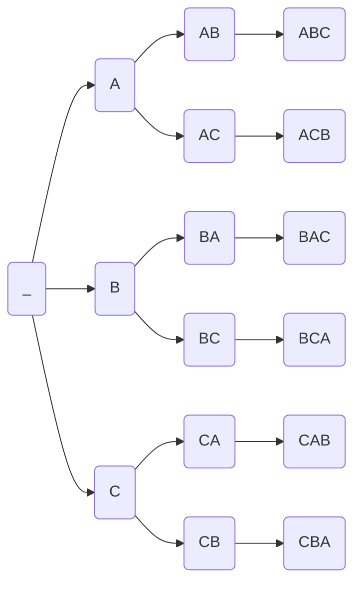

import EqPlot from '../components/MostBeautifulEquation/EqPlot.jsx'
import ExpX from '../components/MostBeautifulEquation/ExpX.jsx'
import NumberLineFunction from '../components/MostBeautifulEquation/NumberLineFunction.jsx'
import HelixCosSin from '../components/MostBeautifulEquation/HelixCosSin.jsx'
import IotaCycle from '../components/MostBeautifulEquation/IotaCycle.jsx'
import TangentCos from '../components/MostBeautifulEquation/TangentCos.jsx'
import TangentSin from '../components/MostBeautifulEquation/TangentSin.jsx'
import TaylorExpansionCos from '../components/MostBeautifulEquation/TaylorExpansionCos.jsx'
import TaylorExpansionSin from '../components/MostBeautifulEquation/TaylorExpansionSin.jsx'
import SlopeLine from '../components/MostBeautifulEquation/SlopeLine.jsx'
import NumberLineMulNegOne from '../components/MostBeautifulEquation/NumberLine.jsx'
import ReImRot from '../components/MostBeautifulEquation/ImaginaryRotation.jsx'
import LinearApproximationTaylor from '../components/MostBeautifulEquation/LinearApproximationTaylor.jsx'

# Math's Most Beautiful Equation for the Unconvinced
 
---
 
## Table of Contents

- [Complex Numbers](#complex-numbers)
- [Unit Circle](#unit-circle)
  - [Equation of Circle](#equation-of-circle)
  - [Measurements from the Unit Circle](#measurements-from-the-unit-circle)
  - [Some Important Identities](#some-important-identities)
- [Taylor Series](#taylor-series)
  - [Definition of Maclaurin Series](#definition-of-maclaurin-series)
  - [Definition of Taylor Series](#definition-of-taylor-series)
- [Derivative](#derivative)
  - [Equation of Straight Line](#equation-of-straight-line)
  - [Definition of Derivative](#definition-of-derivative)
- [Permutation and Combination](#permutation-and-combination)
  - [Definition of Factorial](#definition-of-factorial)
  - [Definition of Permutation](#definition-of-permutation)
  - [Definition of Combination](#definition-of-combination)
- [Binomial Theorem](#binomial-theorem)
  - [Power Rule of Derivatives](#power-rule-of-derivatives)
  - [Coefficients of Taylor Series](#coefficients-of-taylor-series)
  - [Final Formula for Taylor Series](#final-formula-for-taylor-series)
- [Taylor Series Expansion of Common Functions](#taylor-series-expansion-of-common-functions)
  - [Graphical Method for Calculating Derivatives](#graphical-method-for-calculating-derivatives)
  - [Formulas for cos(x), sin(x)](#formulas-for-cosx-sinx)
- [Exponential Function](#exponential-function)
  - [Euler's Number](#eulers-number)
- [The Final Chapter](#the-final-chapter)
 
---
 
 
## Complex Numbers
<NumberLineMulNegOne client:visible/>
 
This is the good and old number line. Here, we see:

> Number is **multiplied by $+1$**
$\Longrightarrow$
**Nothing** happens.

> Number is **multiplied by $-1$**
$\Longrightarrow$
Number gets **reflected** to the other side.
 
Let's see why.  First we start by acknowledging:

$$
\begin{aligned}
\text{Reflection} &\equiv \text{Rotation by} \pm180^{\circ}\\
\text{i.e.} \boldsymbol{-1} &= \boldsymbol{1\angle180^\circ\;\text{or}\;1\angle \pi \; \text{rad}}
\end{aligned}
$$

What's $\text{rad}$?

Radians [ $\text{rad}$ ] is a unit for angle like degrees [$\;^\circ\;$]

If we could accurately measure, we'd find:
 Arc length of the circle **below** (i.e. distance along the full curve of circle) = $6.28318\ldots$

We'll call this constant $2\pi$ $\Longrightarrow \boldsymbol{2\pi = 6.28318\ldots}$
 Why 2? *Historical reasons...*

Some people also call it $\tau$ (as in a full *turn* or complete circle).
 
We can use this arc length to measure the angle instead.
$$
\begin{aligned}
360^\circ &\equiv 2\pi \text{ rad}\\
\\
180^\circ &\equiv \pi \text{ rad}\\
\\
90^\circ &\equiv \frac\pi2 \text{ rad}\\
\\
45^\circ &\equiv \frac\pi4 \text{ rad}\\
\\
{}&\;\;\vdots
\end{aligned}
$$
(*Also it has to be the circle **below**, not some random circle. It's just defined that way.*)

 
<ReImRot client:visible/>
 
But for the **rotation** to be **possible**, we had to add a second **perpendicular axis**.

A natural curiosity would be to only rotate 90$^\circ$ to explore the new axis.

$$
\begin{aligned}
(-1)\times(-1)&=(+1) \\
1\angle180^\circ \times 1 \angle 180^\circ &= 1\angle 360^\circ \\
\\
\text{Similary,}\\
(\text{something})\times (\text{something}) &= (-1) \\
1\angle90^\circ \times 1 \angle 90^\circ &= 1\angle 180^\circ \\
\end{aligned}
$$

Let's find this "$\text{something}$": &nbsp; $x^2 = -1 \Longrightarrow x = \pm \sqrt{-1} = ?$

 
Just like how numbers 0, 1, 2 are different from each other, this is also a new kinda number we have just discovered (we'll call it a *complex number*). Since we don't have any space on the number line, we put it earlier on a new axis (called *imaginary axis*). Our number line was actually a small section of the 2D *complex plane* all along. We denote this number using $i$ (*imaginary*).
 

$$
\begin{aligned}
\boldsymbol{\therefore i^2} &= \boldsymbol{-1}\\
\boldsymbol{i} &= \boldsymbol{1 \angle \frac\pi2}
\end{aligned}
$$

 
---
 
$\boldsymbol{z = x + iy = r\angle \theta}$ can be defined as a **complex number** on the complex plane.

where

$x =$ real part $=$ &nbsp; Re(z) or $\Re (z)$

$y =$ imaginary part $=$ &nbsp; Im(z) or $\Im (z)$

$r =$ distance from origin (0, 0) $ = |z| = \sqrt{x^2 + y^2}$

$\theta = $ angle from X axis $=\arg(z)$
 
---
 
## Unit Circle
Let $z = x+iy$ be any arbitrary point on the circle.

All points of a circle are at same distance (called *radius*) from the center of the circle.

 
### Equation of Circle

$$
\begin{aligned}
|z| &= \text{radius}\\
\sqrt{x^2+y^2}&=r\\
x^2+y^2&=r^2
\end{aligned}
$$
**Unit circle** is the path traced by the number 1 as it rotates around the origin in the complex plane.
 
Number 1 is at distance 1 from origin.

$\Longrightarrow$ All points are at distance 1 from origin.

$\Longrightarrow \text{radius } = 1$

$\therefore r = \text{const }$, $z$ depends mainly on $\theta$

Let $x = f_1(\theta), \text{ }y = f_2(\theta)$

 
### Measurements from the Unit Circle
| | $0$ | $\dfrac{\pi}{4}$ | $\dfrac{\pi}{2}$ | $\dfrac{3\pi}{4}$ |
| :--- | :---: | :---: | :---: | :---: |
| $x=f_1(\theta)$ | $1$ | $\dfrac{\sqrt{2}}{2}$ | $0$ | $-\dfrac{\sqrt{2}}{2}$ |
| $y=f_2(\theta)$ | $0$ | $\dfrac{\sqrt{2}}{2}$ | $1$ | $\dfrac{\sqrt{2}}{2}$ |

 

| | $\pi$ | $\dfrac{5\pi}{4}$ | $\dfrac{3\pi}{2}$ | $\dfrac{7\pi}{4}$ |
| :--- | :---: | :---: | :---: | :---: |
| $x=f_1(\theta)$ | $-1$ | $-\dfrac{\sqrt{2}}{2}$ | $0$ | $\dfrac{\sqrt{2}}{2}$ |
| $y=f_2(\theta)$ | $0$ | $-\dfrac{\sqrt{2}}{2}$ | $-1$ | $-\dfrac{\sqrt{2}}{2}$ |

 
These doesn't seem to be some familiar function. We can define these as new functions named *cosine* and *sine*.
$f_1(\theta)=\cos(\theta)$ and $f_2(\theta)=\sin(\theta)$
 

 
<EqPlot
  funcStrings={['Math.cos(x)']}
  containerStyle = {{
    maxHeight: '200px'
  }}
  boardConfig={{
    boundingbox: [-3*Math.PI, 1.8, 3*Math.PI, -1.8],
    axis: true,
    fixed: true,
    showCopyright: false,
    defaultAxes: {
        x: {
            name: 'θ',
            withLabel: true,
            label: {
                position: 'rt',
                offset: [5, 15],
                anchorX: 'right'
            },
            ticks: {
                scale: Math.PI,
                scaleSymbol: 'π',
                insertTicks: false,
                ticksDistance: 1,
            }
        },
        y: {
            name: 'cos(θ)',
            withLabel: true,
            ticks: {
              ticksDistance: 1,
              insertTicks: false,
              label: {
                offset: [-18, 0]
              }
            },
            label: {
                position: 'rt',
                offset: [-55, 5],
                anchorY: 'top'
            }
        }
    }
  }}
  client:visible
/>
 
<EqPlot
  funcStrings={['Math.sin(x)']}
  containerStyle = {{
    maxHeight: '200px'
  }}
  boardConfig={{
    boundingbox: [-3*Math.PI, 1.8, 3*Math.PI, -1.8],
    axis: true,
    fixed: true,
    showCopyright: false,
    defaultAxes: {
        x: {
            name: 'θ',
            withLabel: true,
            label: {
                position: 'rt',
                offset: [5, -15],
                anchorX: 'right'
            },
            ticks: {
                scale: Math.PI,
                scaleSymbol: 'π',
                insertTicks: false,
                ticksDistance: 1,
                label: {
                  offset: [0, -17]
                }
            }
        },
        y: {
            name: 'sin(θ)',
            withLabel: true,
            ticks: {
              ticksDistance: 1,
              insertTicks: false,
            },
            label: {
                position: 'rt',
                offset: [-55, 5],
                anchorY: 'top'
            }
        }
    }
  }}
  client:visible
/>
 
 
### Some Important Identities

$$
\begin{aligned}
\sin(\theta \pm 2\pi) &= \sin(\theta)\\
\cos(\theta \pm 2\pi) &= \cos(\theta)
\end{aligned}
$$
So, these are called **periodic functions**
(repeat at regular intervals, called *period*)

Here, period $=2\pi$.

$$
\begin{aligned}
\sin(-\theta) &= -\sin\theta\\
\cos(-\theta) &= \cos\theta\\\\
\sin\theta &= \cos(\theta - \frac\pi2)\\
\end{aligned}
$$
---
 

$$
\begin{aligned}
\therefore &\text{ For unit circle:}\\
|z|&=\sqrt{\cos^2\theta + \sin^2\theta}=1\\
z &= cos\theta + i \sin\theta
\end{aligned}
$$

 
Generalizing,

$$
\boldsymbol{z} = \boldsymbol{r\angle\theta = r (\cos\theta + i\sin\theta)}
$$

---
 
## Taylor Series

Why are we learning this now?

While we've just derived what we're calling the cosine function, it has, of course, been known and studied for ages.
Nowadays, we can do all sorts of stuff with computers and calculators. What did they, who actually discovered it the first time, have?

Even if we suppose they had some primitive calculator, how would the calculator understand $\cos x$ or $\sin x$.
Till now, we have only  been able to calculate it graphically (using powerful computers behind the scenes).
But for them, using graphs would be imprecise, subjective, and is not scalable.

Thus, we want to find some kind of formula to numerically calculate $\cos x$ or $\sin x$.

If we have some formula, we could use that for simplification, and perhaps learn some new insights.

 
If we **ignore** the **periodicity** of cosine for a while, we see,

$cos(x)$ resembles $1-x^2$ a liii...ttle bit, especially at the origin ($x=0$).
 

Why $x$, wasn't it $\theta$?

We've started using $x$ instead of $\theta$ because
 finding the formula for some function isn't just specific to $\cos$ or $\sin$.

We wanted to keep it general.
It's just a different name for the same variable,
 (no connection with the $z=x+iy$)

 

How I came up with $1-x^2$

I knew that plot of $f(x)=x^2$ is a parabola (U shaped)

Then $f(x)=-x^2$ should be a ∩ shaped [ $\because\times(-1)$ flipped the direction]

Now, the shape roughly matches.
 
Problem: $cos(0) = 1$ but $f(0)=-0^2 = 0$

Add 1 so that
$f(x) = 1-x^2$

$f(0)=1-0^2 = 1 =cos(0)$

 

<EqPlot
  funcStrings={['1-x*x']}
  containerStyle = {{
    maxHeight: '200px'
  }}
  boardConfig={{
    boundingbox: [-Math.PI-0.18, 2.2, Math.PI+0.36, -2.5],
    axis: true,
    fixed: true,
    showCopyright: false,
    defaultAxes: {
        x: {
            name: 'x',
            withLabel: true,
            label: {
                position: 'rt',
                offset: [5, 15],
                anchorX: 'right'
            },
            ticks: {
                ticksDistance: 0.5,
                scale: Math.PI,
                scaleSymbol: 'π',
                insertTicks: false
            }
        },
        y: {
            name: '1-x^2',
            withLabel: true,
            ticks: {
                ticksDistance: 1,
                insertTicks: false
            },
            label: {
                position: 'rt',
                offset: [-50, 5],
                anchorY: 'top'
            }
        }
    }
  }}
  client:visible
/>
 
---
 
But such method cant be used to accurately approximate. We need a more robust method.
Let us take a **leap of faith** and just say...

$\cos x \approx a_0 + a_1x + a_2x^2 + \ldots$
 

We need to find a method that will calculate 
* $a_0 = ?$
* $a_1=?$
* $a_2=?$

$\qquad\quad\vdots$

 

We don't know anything about $\cos$. We can only **evaluate** $\cos x$ at **different points** using that unit circle.
 

So, we need to find something that'll take values of $cos(x)$ at different points and spit out $a_0, a_1, a_2, \ldots$
 
For $f(x)=x^3$, we would provide

$f(0) = 0$, $f(1) = 1$, $f(2) = 8$, $\ldots$

and it would output
* $a_3 = 1$,
* $a_0 = a_1 = a_2 = a_4 = \ldots = 0$

 
---
 
The leap of faith we took earlier to approximate $\cos x$ is actually called the **Maclaurin series**.
 

### Definition of Maclaurin Series
$f(x) = a_0 + a_1 x + a_2 x^2 + \ldots$
 
Maclaurin series is actually a **generalization of Taylor series**.

(approximated at origin i.e. calculated at $\boldsymbol{a = 0}$)
 

### Definition of Taylor Series
**Taylor Series expansion**  of a function f(x) **at point** $\boldsymbol{x = a}$ is:

$$
\begin{aligned}
\boldsymbol{f(x)}&= \boldsymbol{a_0}\\
{}&+ \boldsymbol{a_1(x-a)}\\
{}&+ \boldsymbol{a_2(x-a)^2}\\
{}&+ \boldsymbol{\dots}
\end{aligned}
$$
Now, we just need to find these coefficients $a_0$, $a_1$, $a_2$, $\ldots$ somehow then, we're done.

We'll then have the formulas for $\cos x$ and $\sin x$.
 
---
 
## Derivative
If we evaluate the approximated function $f(x)$ at $x = a$

$$
\begin{aligned}
f(a) &= a_0 \\
{}&+ a_1(a-a)\\
{}&+a_2(a-a)^2\\
{}&+\ldots\\\\
\Longrightarrow a_0 &= f(a)
\end{aligned}
$$
**We found one coefficient!**

The approximation still has an infinite no. of terms which I don't even know what to do with.

So, let us simplify the approximation a little bit. (*just to explore*)

$$
\begin{aligned}
f(x) &\approx f(a) + a_1 (x-a)\\
\\
\Longrightarrow a_1 &= \dfrac{f(x)-f(a)}{x-a}
\end{aligned}
$$
Hmm, this reminds me of something. Let's take a quick detour.

---
 
### Equation of Straight Line

For a *circle*,

**distance** between **origin** and any **point** of circle $= \text{constant}$
 
For a *straight line*,

**steepness** $= \text{constant}$

i.e. Relationship between **vertical change (rise)** and **horizontal change (run)** $= \text{constant}$ (called **Slope**)

$$
\begin{aligned}
\text{Slope}&=\frac{\text{Rise}}{\text{Run}}&=\frac{\Delta f}{\Delta x}\\
\\
a_1 &= \dfrac{f(x)-f(a)}{x-a} &= \frac{\Delta f}{\Delta x}
\end{aligned}
$$
So, the equation we saw earlier is actually the **equation of a straight line**.

The detour we took was to explain this.
 
<SlopeLine client:visible/>
 
---
 
Hmm, so we can only approximate the function as a line (called **tangent line**).

This is because we had earlier ignored all the other terms like $a_2 (x-a)^2+a_3(x-a)^3+\ldots$

The curviness is not approximated yet.
 
<LinearApproximationTaylor client:visible/>
 
Still, this approximation **definitely holds** near $x=a$ and **only near** $x=a$.

And remember, Taylor series was calculated at $x=a$.
 

This means, we could use this to find $a_1$ (the next piece of our puzzle)

$a_1|_{x=a} = \frac{f(a)-f(a)}{a-a}=\frac00=\text{undefined }$
$[\because \Delta x = 0]$
 
Bad luck 😔

Wait a minute!

$\frac{0.00000000000000001}{0.00000000000000002} = \frac12=0.5 \text{ (some value)}$
 
So, if $x$ is *veryy veryyy* close to a but $x\ne a$ i.e. $x\to a$:

$a_1|_{x\to a} = \frac{\text{very small}}{\text{very small}}=\text{some value }$
$[\because \Delta x \ne 0, \Delta x \to 0]$
 
We're back on track and we actually just discovered **derivative**.
 
---
### Definition of Derivative
$$
\begin{aligned}
\boldsymbol{f'(x)} \text{ or } \boldsymbol{\frac{d}{dx}f(x)} &= \boldsymbol{\lim_{\Delta x \to 0} \frac{\Delta f}{\Delta x}}
\end{aligned}
$$
 
*Alternatively,*

$$
\begin{aligned}
f'(x)&= \lim_{\Delta x \to 0} \frac{f(x + \Delta x) - f(x)}{\Delta x}\\
\\
f'(x)&= \lim_{\Delta x \to 0} \frac{f(x) - f(x - \Delta x)}{\Delta x}\\
\\
f'(x)&= \lim_{\Delta x \to 0} \frac{f(x + \Delta x) - f(x - \Delta x)}{2\Delta x}\\
\end{aligned}
$$

 

---
 
Now we can say,
$a_1 = f'(a)$

**Finally, two coefficients fou...**

Wait! Now, **how do I evaluate** $\boldsymbol{f'(a)}$? Do I again make a Taylor series for $f'(x)$ 😳

Hang on, we also have the **definition of derivative** now. Maybe we could find an expression for $f'(x)$ using that.

My mind will crash if I try to do anything with those infinite no. of terms.

Let's try to **generalize** $f(x)$ to see if we can simplify the process.
 

$$
\begin{aligned}
f(x) &= a_0\\
{}&+a_1(x-a)\\
{}&+ a_2(x-a)^2\\
{}&+\dots\\\\
{}&= \sum_{n=0}^\infty \text{ }a_n (x-a)^n\\
\\
\text{where }a_0&=f(a),\\
a_1&=f'(a)\\
a_2&=\text{ }?\\
a_3&=\text{ }?\\
{}&\vdots
\end{aligned}
$$

---
 
I'm no expert, but trying to find the derivative of this monster, 
$\sum_{n=0}^\infty \text{ }a_n (x-a)^n$
, seems scary. 😨

How about we tone it down, and first find the derivative of $x^n$. That seems more approachable, isn't it?

We'll use that definition of derivative we learnt just earlier.

$$
\begin{aligned}
g(x) &= x^n\\
\Longrightarrow g'(x) &= \lim_{\Delta x \to 0} \frac{g(x+\Delta x)-g(x)}{\Delta x}\\
\\
{}&= \lim_{\Delta x \to 0} \frac{(x+\Delta x)^n - x^n}{\Delta x}
\end{aligned}
$$
 
**UHHHH!!!** We are again stuck. 😭

We need to **somehow evaluate** $\boldsymbol{(x+\Delta x)^n}$

Then, probably we could figure out how to find $f'(x)$ then, eventually $a_1 = f'(a)$ 🥹
 
Only if it was $(x+\Delta x)^2$ or $(x + \Delta x)^3$, I would expand it in a minute...
 
---
 
## Permutation and Combination
Let's start with a simple example.

$$
\begin{aligned}
(a+b)^2 &= (a+b)(a+b)\\
{}&= \textcolor{darkred}{aa} + \textcolor{#0099FF}{ab} + \textcolor{#0099FF}{ba} + \textcolor{green}{bb}\\
{}&= \textcolor{darkred}{a^2} + \textcolor{#0099FF}{2ab} + \textcolor{green}{b^2}
\end{aligned}
$$

We can see the $2$ is there **because** there are **2 ways to combine $a$ and $b$**.

(i.e. $ab$ and $ba$)

 
There is only **$1$ way to combine $a$ and $a$**

(i.e. $a^2$)
 
There is only **$1$ way to combine $b$ and $b$**

(i.e. $b^2$)
 
If we manage to find the total **combinations**, we'll know the coefficients of the expanded expression too.
 
Another example:

$$
\begin{aligned}
(a+b)^3 &= (a+b)(a+b)(a+b)\\\\
{}&= \textcolor{#DF0000}{aaa}\\
{}&\text{ }+ \textcolor{#0099FF}{aab} + \textcolor{#0099FF}{aba} + \textcolor{#0099FF}{baa}\\
{}&\text{ }+ \textcolor{green}{abb} + \textcolor{green}{bab} + \textcolor{green}{bba}\\
{}&\text{ }+ \textcolor{#FF0099}{bbb}\\\\
{}&= \textcolor{#DF0000}{a^3} + \textcolor{#0099FF}{3a^2b} + \textcolor{green}{3ab^2} + \textcolor{#FF0099}{b^3}
\end{aligned}
$$

We got an $aaa$ because three $(a+b)$'s are multiplied together. We get three $a$'s from the three $(a+b)$'s.

Now, we have three $a$'s and three $b$'s from the three $(a+b)$'s.

There are **three slots** that we need to **fill** using the three $a$'s and $b$'s
|Slot 1|Slot 2|Slot 3|
|---|---|---|
|.|.|.|

 
---
 
Instead of trying to fill the slots with repeating characters $a$, $b$,
let's try to fill the slots using separate characters A, B, C first.

Let's see the decision tree for filling these slots.

#### For one slot
There are only $3$ choices (A, B or C)

#### For two slots
There are $3\times 2=6$ choices (AB, AC, BA, BC, CA or CB)

#### For three slots
There are $3\times 2 \times 1=6$ choices (ABC, ACB, BAC, BCA, CAB or CBA)

This is actually the **factorial function**.
 
---
 
### Definition of Factorial

Factorial of n can be defined as

$$
\begin{aligned}
\boldsymbol{n!}&=\boldsymbol{n\times(n-1)!}\\
\boldsymbol{0!}&= \boldsymbol1\\
\\
\text{Example: }3!&=3\times 2!\\
{}&=3\times2\times1!\\
{}&=3\times2\times1\times0!\\
{}&=3\times2\times1
\end{aligned}
$$
 
---
### Definition of Permutation
 

No. of ways of arranging $n$ **distinct objects** into $n$ **slots** $=n!$

Example:

There are $3\times 2\times 1 = 3!$ ways of arranging A, B, C into 3 slots

 

Similarly,

There are $3\times 2 = \dfrac{3!}{1!}$ ways of arranging A, B, C into 2 slots

There are $3 = \dfrac{3!}{2!}$ ways of arranging A, B, C into 1 slot

  
**Total permutations**

i.e. no. of ways of arranging $n$ **distinct objects** into $r$ **slots**:
$$
\boldsymbol{P(n,r)=\frac{n!}{(n-r)!}}
$$
 
---
 
Now, we're ready for repeating characters. This was the actual problem we were tackling.

We had $3$ slots to fill using the three $a$‘s and $b$‘s from the three $(a+b)'s$
 
Example:

Using three $a$'s, we can only combine it only as $aaa = a^3$

But, no. of permutations would be:
$P(3,3)= \dfrac{3!}{(3-3)!}=6$

$\because$ Formula for total **permutations** requires objects to be **distinct**.

If we treat the three $a$'s as distinct ($\textcolor{#DF0000}a \textcolor{#0099FF}a \textcolor{green}a$):
|Slot 1|Slot 2|Slot 3|
|---|---|---|
|$\textcolor{#DF0000}a$|$\textcolor{#0099FF}a$|$\textcolor{green}a$|
|$\textcolor{#DF0000}a$|$\textcolor{green}a$|$\textcolor{#0099FF}a$|
|$\textcolor{green}a$|$\textcolor{#0099FF}a$|$\textcolor{#DF0000}a$|
|$\textcolor{green}a$|$\textcolor{#DF0000}a$|$\textcolor{#0099FF}a$|
|$\textcolor{#0099FF}a$|$\textcolor{green}a$|$\textcolor{#DF0000}a$|
|$\textcolor{#0099FF}a$|$\textcolor{#DF0000}a$|$\textcolor{green}a$|
 
But in reality, the three $a$'s are not distinct.
All of these $aaa$ are equal to $a^3$.
 
---
### Definition of Combination
 
So, we define:

**Total combinations**
$$
\boldsymbol{{n \choose r} \text{ or } C(n, r) = \dfrac{n!}{(n-r)!\text{ } r!}}
$$
 
Let's try it out.

$(a+b)^3 = a^3 + 3a^2 b + 3ab^2 + b^3$

From the $3a^2b$, we can say,
there are 3 ways of combining 1 $b$ in 3 slots ($aab, aba, baa$)

Verifying:
${3 \choose 1} = \dfrac{3!}{(3-1)!\text{ } 1!} = \dfrac{3\times2\times1}{(2\times1)\times 1} = 3$
✅

 
---
 
## Binomial Theorem

$$
\begin{aligned}
\boldsymbol{(a+b)^n} &= \boldsymbol{\binom{n}{0}a^n}\\
{}&+ \binom{n}{1}a^{n-1}b\\
{}&+ \quad\vdots\\
{}&+ \binom{n}{n}b^n\\
\\
{}&= \boldsymbol{\sum_{k = 0}^n \binom{n}{k}a^n b^{n-k}}
\end{aligned}
$$
 
**FINALLY**, all the hard work has paid off! We now have a way to expand $(x+\Delta x)^n$. 😇

---
### Power Rule of Derivatives
 

Now, let's rewind a bit. The whole reason we got into the rabbit hole was to find an expression for the derivative of Taylor series of a function $f(x)$.

We're now one step closer in that direction!

We now know,

$$
\begin{aligned}
(x+\Delta x)^n &= \binom{n}{0}x^n\\
{}&+ \binom{n}{1}x^{n-1}\Delta x\\
{}&+ \binom {n}{2}x^{n-1}\Delta x^2\\
{}&+ \ldots\\
{}&+ \Delta x^n\\
\\\\
{}&= x^n\\
{}&+ nx^{n-1}\Delta x\\
{}&+ \binom{n}{2}x^{n-1}\Delta x^2\\
{}&+ \dots\\
{}&+ \Delta x^2
\\\\
g'(x) &= \lim_{\Delta x\to 0}\frac{(x+\Delta x)^n - x^n}{\Delta x}\\\\
{}&= \lim_{\Delta x\to 0}\quad nx^{n-1}\\
{}&\qquad\qquad+ \binom{n}{2}x^{n-1}\Delta x\\
{}&\qquad\qquad+ \ldots\\\\
{}&= nx^{n-1}
\end{aligned}
$$

 
This is called the **power rule of derivatives**.
 

$$
\begin{aligned}
\boldsymbol{\therefore \frac{d}{dx}x^n} &= \boldsymbol{nx^{n-1}}\\\\
\boldsymbol{\therefore\frac{d}{dx}(x-a)^n} &= \boldsymbol{n(x-a)^{n-1}}
\end{aligned}
$$

 
---
### Coefficients of Taylor Series
 
Now, back to Taylor series!

We can now apply the power rule to calculate the derivatives:
 

$$
\begin{aligned}
 f(x) &= a_0\\
{}&+ a_1 (x-a)\\
{}&+ a_2 (x-a)^2\\
{}&+ a_3 (x-a)^3\\
{}&+ \dots \\
 \\
 f'(x) &= 0\\
{}&+ a_1\\
{}&+ 2a_2 (x-a)\\
{}&+ 3a_3 (x-a)^2\\
{}&+ \dots \\
 \\
 f''(x) &= 0\\
{}&+ 0\\
{}&+ 2a_2\\
{}&+ (3 \cdot 2)a_3 (x-a)\\
{}&+ \dots \\
 \\
 f'''(x) &= 0\\
{}&+ 0\\
{}&+ 0\\
{}&+ (3 \cdot 2 \cdot 1)a_3 x\\
{}&+ \dots\\
\\
{}&\quad\vdots
\\\\
[\because \dfrac{d}{dx}&\text{const} = 0]
\end{aligned}
$$

 
**Generalizing,** $n^\text{th}$ derivative of $f(x)$:

$$
\begin{aligned}
f^{(n)}(x) &= \text{ }n!\text{ }a_n\\
{}&+ (n+1)!\text{ }a_{n+1}(x-a)\\
{}&+ (n+2)!\text{ }a_{n+2}(x-a)^2\\
{}&+ (n+3)!\text{ }a_{n+2}(x-a)^3\\
{}&+\ldots\\\\
f^{(n)}(a) = \text{}&n!\text{ } a_n + 0 + 0 + \dots\\\\
\Longrightarrow \boldsymbol{a_n} = &\text{ }\boldsymbol{\frac{f^(n)(a)}{n!}}
\end{aligned}
$$
 
**Et voilà!!!!!** 🎉

We have the formula for the coefficients of Taylor expansion. This is what makes it **THE TAYLOR SERIES**.

Without them, this is just a generic **power series**.

$f(x) = a_0 + a_1 (x-a) + a_2 (x-a)^2 + \ldots$

$\qquad = \sum_{n = 0}^\infty a_0 (x-a)^n$
 
---
 
### Final Formula for Taylor Series

$$
\begin{aligned}
f(x) &= \sum_{n=0}^{\infty} \frac{f^{(n)}(a)}{n!} (x-a)^n \\
\\\\
\therefore\boldsymbol{f(x)}    &= \boldsymbol{f(a)}\\\\
    {}&+ \boldsymbol{\frac{f'(a)}{1!}(x-a)}\\\\
    {}&+ \boldsymbol{\frac{f''(a)}{2!}(x-a)^2}\\\\
    {}&+ \boldsymbol{\frac{f'''(a)}{3!}(x-a)^3}\\\\
    {}&+ \boldsymbol{\ldots}
\end{aligned}
$$

Remember, the whole reason **we got into finding derivative** of Taylor's series was so we could evaluate $\boldsymbol{a_1 = f'(a)}$.

But, we **ended up solving** a even **bigger problem**. We found a **formula** for all the **coefficients** of Taylor's series.

The **original problem** still remains, how do we evaluate $\boldsymbol{f'(a)}$, $\boldsymbol{f''(a)}$, $\ldots$

We have partially solved it for functions like $f(x)=x$, $\;x^2$, $\;x^{0.3}$, $\;x^4$, $\;\ldots$ $\;x^n$.

We are still unable to find $f'(a)$, $f''(a)$, $\ldots$ for $f(x)=\cos x$ or $f(x)=\sin x$.

---
## Taylor Series Expansion of Common Functions

We could try doing something like:

$f(x) = \cos x$

$f'(x) = \lim_{\Delta x\to 0}\dfrac{\cos(x+\Delta x) - \cos x}{\Delta x}$

Now what, we again evaluate $\cos (x + \Delta x)$ **???**

We evaluated $(x+\Delta x)^n$ earlier and for that, we had to discover a new theorem altogether, the **Binomial Theorem**.
 
But I actually have a friend, and she told me, it's a **complicated** route. We need a **lot of knowledge about trigonometry and limits**. So, let's not do that!
 
**Possible options:**
* ~~Power rule of derivative~~
* ~~Limit definition~~
* Graph ??

---

### Graphical Method for Calculating Derivatives
**Remember**, when we **simplified the Taylor series approximation** as:

$f(x)\approx a_0 + a_1 (x-a)$

**We found:**

$f'(x) =\;$ **Slope of tangent** line to function $f(x)$
 
 

The earlier case of $f(x)=x^n$ was **too general** as **$n$ can be anything**.

It's **graph** could be quite literally anything from a **straight line** to **parabola** to **some other weird shape**.
 

But,
**we know what $\boldsymbol{\cos x}$ and $\boldsymbol{\sin x}$ look like**.

**So, let's try the graphical method!**
 

 
<TangentSin client:visible/>
 
 
<TangentCos client:visible/>
 

$$
\begin{aligned}
\therefore\boldsymbol{\frac{d}{dx}\sin x} &= \boldsymbol{\cos x}\\
\\
\therefore\boldsymbol{\frac{d}{dx}\cos x} &= \boldsymbol{-\sin x}
\end{aligned}
$$

 
---
### Formulas for cos(x), sin(x)
 

|$f(x)$|$\cos x$|$\sin x$|
|---:|---:|---:|
|$f'(x)$|$-\sin x$|$\cos x$|
|$f''(x)$|$-\cos x$|$-\sin x$|
|$f'''(x)$|$\sin x$|$-\cos x$|
|$f''''(x)$|$\cos x$|$\sin x$|
|$\vdots$|$\vdots$|$\vdots$|

 

|$f(0)$|$\cos 0 =$ **1**|$\sin 0 =$ **0**|
|---:|---:|---:|
|$f'(0)$|$-\sin 0 =$ **0**|$\cos 0 =$ **1**|
|$f''(0)$|$-\cos 0 =$ **-1**|$-\sin 0 =$ **0**|
|$f'''(0)$|$\sin 0 =$ **0**|$-\cos 0 =$ **-1**|
|$f''''(0)$|$\cos 0 =$ **1**|$\sin 0 =$ **0**|
|$\vdots$|$\vdots$|$\vdots$|

 

$\therefore \cos x$ and $\sin x$ can be approximated at $x = a$ as:
 
$$
\begin{aligned}
\cos x \approx 1
 &- \dfrac{(x-a)^2}{2!} \\
 {}& + \dfrac{(x-a)^4}{4!} \\
 {}& - \dfrac{(x-a)^6}{6!} \\
 {}& + \quad + \dots +\quad+ \dfrac{x^N}{N!}\\\\
\text{[N }&\text{is even]}
\end{aligned}
$$

 

$$
\begin{aligned}
\sin x \approx x
           & - \dfrac{(x-a)^3}{3!} \\
           & + \dfrac{(x-a)^5}{5!} \\
           & - \dfrac{(x-a)^7}{7!} \\
           & +\quad \dots\quad
            + \dfrac{x^N}{N!}\\\\
\text{[N }&\text{is odd]}
\end{aligned}
$$

  

 
<TaylorExpansionCos client:visible/>
 

 
<TaylorExpansionSin client:visible/>
 

 
**Higher the no. of terms**, the **more accurate** the approximation will be **around** the point $x=a$.

If we **approximate** near **origin** (i.e. use Maclaurin series), **both sides** (+x, -x) can be **equally captured**.

 

$\therefore\text{ }$ If the no. of terms $ \to \infty$ and we approximate near origin i.e. $a = 0$,

* $\cos x=$ Taylor series approximation of $\cos x$
* $\sin x=$ Taylor series approximation of $\sin x$

 
🥳 **NOW, WE FINALLY HAVE THE FORMULA FOR $\cos x$ AND $\sin x$ !!!**

$$
\begin{aligned}
\therefore \boldsymbol{\cos x} &= \boldsymbol{1 - \frac{x^2}{2!} + \frac{x^4}{4!} - \frac{x^6}{6!} + \dots} \\
\\
\therefore \boldsymbol{\sin x} &= \boldsymbol{x - \frac{x^3}{3!} + \frac{x^5}{5!} - \frac{x^7}{7!} + \dots}
\end{aligned}
$$

 
---
 
## Exponential Function
Now, we can use the **expressions we found** for $\boldsymbol{\cos x}$ and $\boldsymbol{\sin x}$ and get back to the **unit circle**. We might **learn some new insights**.

Let $\boldsymbol z$ be some **arbitrary point on the unit circle**.
 
$$
\begin{aligned}
z &= \cos \theta + i \sin \theta\\
\\
{}&= \left[1 - \frac{\theta^2}{2!} + \frac{\theta^4}{4!} - \frac{\theta^6}{6!} + \dots\right]\\
{}&+ i\left[x - \frac{\theta^3}{3!} + \frac{\theta^5}{5!} - \frac{\theta^7}{7!} + \dots\right]\\
\\\\
{}&= \textcolor{hotpink}1\;\frac{\theta^0}{0!}
\textcolor{brown}+\textcolor{brown}i\;\frac{\theta^1}{1!}
\textcolor{green}{-1} \frac{\theta^2}{2!}
\textcolor{gray}{-i}\;\frac{\theta^3}{3!}\\
\\
{}&\;\textcolor{hotpink}{+1}\; \frac{\theta^4}{4!}
\textcolor{brown}{+ i}\;\frac{\theta^5}{5!}
\textcolor{green}{-1} \frac{\theta^6}{6!}
\textcolor{gray}{-i}\;\frac{\theta^7}{7!}\\
\end{aligned}
$$

 
 
<IotaCycle client:visible/>
 
 

$i^0 = 1, \quad i^1 = i, \quad i^2 = -1, \quad i^3 = -i$

$i^4 = 1, \quad i^5 = i, \quad i^6 = -1, \quad i^7 = -i$

$\vdots\qquad\qquad\vdots\qquad\qquad\vdots\qquad\qquad\vdots$

$\Longrightarrow i^n = \begin{cases}
  1  & \text{if } n \equiv 0 \pmod{4} \\
  i  & \text{if } n \equiv 1 \pmod{4} \\
  -1 & \text{if } n \equiv 2 \pmod{4} \\
  -i & \text{if } n \equiv 3 \pmod{4}
\end{cases}$
 

$$
\begin{aligned}
z &= \frac{(i\theta)^0}{0!} + \frac{(i\theta)^1}{1!} + \frac{(i\theta)^2}{2!} + \ldots
\end{aligned}
$$
 
We have **accidentally discovered** the **Taylor series** for **a new function**!

We'll name the new function:

$$
\begin{aligned}
z&= \exp\; (i\theta)\\\\
\Rightarrow\exp\;(i\theta) &= 1 + i\theta \;+ \frac{(i\theta)^2}{2!} + \frac{(i\theta)^3}{3!}+ \;\ldots\\
\\
\Rightarrow\boldsymbol{\exp\;(x)} &= \boldsymbol{1 + x \;+\; \frac{x^2}{2!} \;\;+\; \frac{x^3}{3!} \;\;+ \;\ldots}
\end{aligned}
$$

 
We just know the **Taylor series** of the function. We **don't know what** the **function** actually **looks like** or **behaves like**. Let's plot it and see!
 
---
### Euler's Number
 
<ExpX client:visible />
 
The plot shows that $\exp (x)$ is a function that rapidly grows.
The only other function that shows this kind of behavior is $n^x$ where $n>1$.

Example:
|$3^1$|3|
|---|---|
|$3^2$|9|
|$3^3$|27|
|$3^4$|81|
|$3^5$|243|
 
 
From graph, we can see:

$$
\begin{aligned}
\boldsymbol{\exp (x)} &= \boldsymbol{2.71828^x}\\
{}&= \boldsymbol{e^x}
\end{aligned}
$$

The constant $e = 2.7182812824\ldots$ is called **Euler's number** or **Napier's number**.
 
$\therefore$ The earlier expression for some arbitrary point $z$ on the unit circle in the imaginary plane can be written as:
$$
z = \exp(i\theta) = e^{i\theta}
$$
---
 
## The Final Chapter

It's been quite the road, but we've **almost reached our destination**!

As the journey is almost over, let's **play a game**!

**You need to guess which functions are these**.
 **Gotta play fair, don't press the button!**
 
<NumberLineFunction client:visible/> 

Reveal the answer.

* $f(x)=x$
* $f(x)=\sin x$
* $f(x)=x^2$
* $f(x)=x^3$
* $f(x)=\cos x$

 
**Press the button to check** if you don't believe me. You haven't already pressed it, have you? 🤨

Anyways, congrats, if you got it, because I wouldn't.

From this view, even functions like $x^5$, $2x$, $1753x$, $x^7$, $x^{153}$ $\ldots$ **all** would **look the same** as $f(x)=x$. 🤷
 
This is because we are actually **familiar** with **seeing** $\boldsymbol{f(x)}$ **vs** $\boldsymbol x$ plots.

**This one is $\boldsymbol {f(x)}$ only.**
We evaluated the function at many points and **plotted** them **on a vertical number line**.

 
---
 
Guess what, we have been making the **same mistake** for $\boldsymbol{f(\theta)=e^{i\theta}}$

The unit circle was just the $f(\theta)$.

We need to actually **add a third axis** and plot
$\boldsymbol{f(\theta)}$  vs $\boldsymbol\theta$.
<HelixCosSin client:visible />
🤯 **Now, we see the full picture!**

$f(\theta)=e^{i\theta}$ is actually a **helix**.
* In one view, we see $\boldsymbol{\cos \theta}$.
* In another, we see $\boldsymbol{\sin \theta}$.
* In another, the familiar **unit circle**.
 
**It's all a matter of perspective.**
On paper, it seems like an innocent equation you might skim over, but this string of symbols, known as **Euler's Formula**, holds an incredible secret we now understand. 😌

$$
\boldsymbol{e^{i\theta} = \cos\theta + i\sin\theta}
$$
 
Anyways,

When $\theta=180^\circ$ (i.e. $\pi\text{ rad}$),
 $\cos\theta=-1$, $\;\sin\theta=0$

---
 

$$
\boldsymbol{\therefore e^{i\pi} + 1 = 0}
$$

**"The most beautiful equation in Mathematics !!!"**

 
 
Its **beauty** lies in weaving the **fundamental constants of mathematics** into a single string:
* The additive identity $0$
* The multiplicative identity $1$
* The fundamental circle constant $\pi$
* The number $e$ from the heart of analysis
* The imaginary unit $i$
 
---
 
 
---

**P.S.**&nbsp;&nbsp; This equation is actually equivalent to the one we started our expedition with ($1\angle 180^\circ \equiv -1$). &nbsp;We've come a full *circle*, indeed! 😉

---
 

